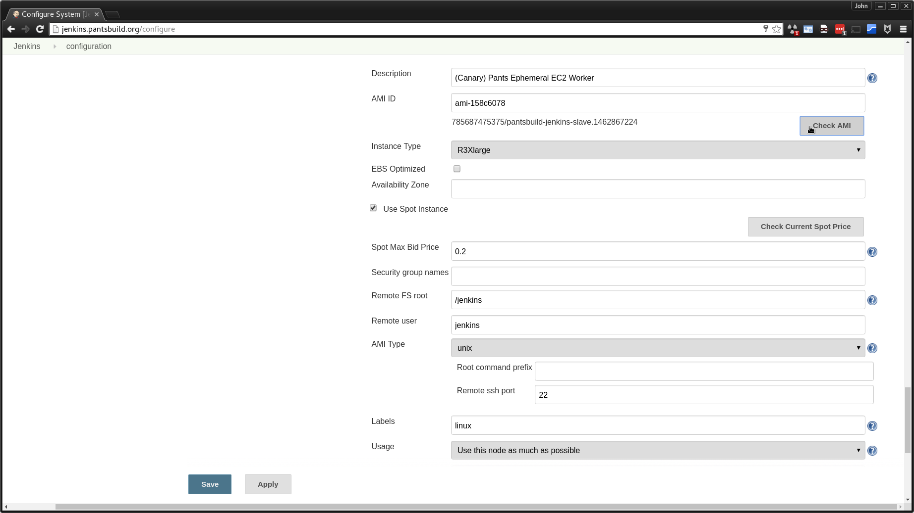

# Pantsbuild Jenkins Slave AMI Creation

This directory contains [Packer](https://packer.io) scripts to build pants jenkins AWS slave
images (AMIs). As a pre-requisite to updating or testing AMIs you'll need to have access to the
pantsbuild AWS account. This document does not yet outline a formal process to get access, but you
can ask on [pants-devel](https://groups.google.com/forum/#!forum/pants-devel) or in
[#infra](https://pantsbuild.slack.com/messages/infra/) if you want to contribute an AMI fix or
enhancement and folks will help steer you in the right direction.

## Updating the AMI

The Jenkins slave AMI is tied tightly to its base AMI and the class of instance-types it expects to
be deployed on. The base AMI is `ami-840910ee`, which is a 64 bit Ubuntu 16.04 LTS (Xenial) image
from Canonical. The expected deployment instance-types are assumed to have local instance storage
provided by an SSD with TRIM support presented through the `/dev/xvdb` device. With these things in
mind, you can make changes to the Jenkins slave AMI as follows:

1. Download and install [packer](https://www.packer.io/downloads.html) if you have not already.

2. Modify build scripts to make the changes you want (e.g. install packages via `apt`).
    An AMI build uses a small template file, [`jenkins-slave.json`]
    (https://github.com/pantsbuild/pants/blob/master/build-support/aws/ec2/packer/jenkins-slave.json)
    described [here](https://www.packer.io/docs/templates/introduction.html). Our template offloads
    most work provisioning the image to a series of shell scripts. It's these scripts you'll likely
    need to modify. If it makes sense to break out a new script, just make sure to add it to the
    `scripts` list in `jenkins-slave.json`.

3. Build the new AMI.
    Ensure you have a [`~/.aws/credentials`]
    (http://docs.aws.amazon.com/cli/latest/userguide/cli-chap-getting-started.html#cli-config-files)
    ini file and that you have a section with your pantsbuild `aws_access_key_id` and
    `aws_secret_access_key`. Assuming the section is named `pantsbuild`, issue this command (The
    `packer-io` binary may be spelled `packer` on your machine):

        $ AWS_PROFILE=pantsbuild packer-io build jenkins-slave.json

    This takes a while! Be prepared to wait 30 minutes or more. You'll see output like so (most
    `apt` output snipped):

        ==> amazon-ebs: Prevalidating AMI Name...
        ==> amazon-ebs: Inspecting the source AMI...
        ==> amazon-ebs: Creating temporary keypair: packer 57292374-5946-13c9-5c5f-76565e326d10
        ==> amazon-ebs: Creating temporary security group for this instance...
        ==> amazon-ebs: Authorizing access to port 22 the temporary security group...
        ==> amazon-ebs: Launching a source AWS instance...
            amazon-ebs: Instance ID: i-b2fb8e35
        ==> amazon-ebs: Waiting for instance (i-b2fb8e35) to become ready...
        ==> amazon-ebs: Waiting for SSH to become available...
        ==> amazon-ebs: Connected to SSH!
        ==> amazon-ebs: Provisioning with shell script: jenkins-slave.packages.sh
            amazon-ebs: Reading package lists...
            amazon-ebs: Building dependency tree...
            amazon-ebs: Reading state information...
            amazon-ebs: The following additional packages will be installed:
        ... [snipped] ...
            amazon-ebs: wget is already the newest version (1.17.1-1ubuntu1).
            amazon-ebs: 0 upgraded, 0 newly installed, 0 to remove and 0 not upgraded.
        ==> amazon-ebs: Stopping the source instance...
        ==> amazon-ebs: Waiting for the instance to stop...
        ==> amazon-ebs: Creating the AMI: pantsbuild-jenkins-slave.1462313844
            amazon-ebs: AMI: ami-ee618083
        ==> amazon-ebs: Waiting for AMI to become ready...
        ==> amazon-ebs: Terminating the source AWS instance...
        ==> amazon-ebs: Cleaning up any extra volumes...
        ==> amazon-ebs: No volumes to clean up, skipping
        ==> amazon-ebs: Deleting temporary security group...
        ==> amazon-ebs: Deleting temporary keypair...
        Build 'amazon-ebs' finished.

        ==> Builds finished. The artifacts of successful builds are:
        --> amazon-ebs: AMIs were created:

        us-east-1: ami-ee618083

    Take note of the AMI id output in the final line (`ami-ee618083` in this example), you'll need
    this to test the image and re-configure Jenkins to use the new AMI.

## Testing the AMI

### Launch an instance manually

You can launch an instance using the AMI you created either using the AWS console or via cli tools
and then ssh into it and inspect it. Here is an example using
[Amazon's CLI tools](https://aws.amazon.com/cli/):

1. Launch an instance.
    This command will launch an instance, but the process is asynchronous, so you'll need to grab
    the instance id for the next step:

        $ AWS_PROFILE=pantsbuild aws ec2 run-instances \
          --region us-east-1 \
          --image-id ami-ee618083 \
          --key-name pantsbuild-jenkins-bot \
          --count 1 \
          --instance-type r3.xlarge | tee run-instances.json | grep InstanceId
                    "InstanceId": "i-37394ab0",

2. Poll for the instance public ip to ssh in with.
    NB: You may need to run this command a few times before the public ip is available:

        $ AWS_PROFILE=pantsbuild aws ec2 describe-instances \
          --region us-east-1 \
          --instance-ids i-37394ab0 | tee describe-instances.json | grep PublicIpAddress
                            "PublicIpAddress": "52.207.240.194",

3. Log in to the instance over ssh.
    The `ubuntu` user is configured for password-less `sudo` should you need it:

        $ ssh ubuntu@52.207.240.194
        The authenticity of host '52.207.240.194 (52.207.240.194)' can't be established.
        ECDSA key fingerprint is SHA256:s6tLGvGMZWte21GW6ATEu1NlseR7lU3B/lZCwhdg0NM.
        Are you sure you want to continue connecting (yes/no)? yes
        Warning: Permanently added '52.207.240.194' (ECDSA) to the list of known hosts.
        Welcome to Ubuntu 16.04 LTS (GNU/Linux 4.4.0-21-generic x86_64)

        *** This is a pantsbuild.org Jenkins Slave ***

        To configure, see:
          https://github.com/pantsbuild/pants/blob/master/build-support/aws/ec2/packer/README.md

        0 packages can be updated.
        0 updates are security updates.

        ubuntu@ip-172-31-9-190:~$

4. Terminate the instance after you're done using it.
    We're charged for these, so don't forget to kill the instance:

        $ AWS_PROFILE=pantsbuild aws ec2 terminate-instances \
          --region us-east-1 \
          --instance-ids i-37394ab0

### Configure Jenkins to use the AMI

Ideally you'll have launched an instance manually using the AMI you created in order to vet it.
When you're confident in the image, navigate to [Jenkins > Manage Jenkins > Configure System]
(http://jenkins.pantsbuild.org/configure). Towards the bottom of the page you'll find an `AMI ID`
field in the `AMIs` section. Enter the AMI id here and click the `Check AMI` button to verify
Jenkins can access it. A Successful id-edit and check is shown below:

