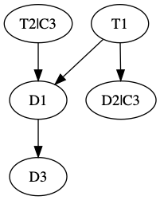

Build Graph Operations
======================

Pants supports a number of tasks that perform operations on the build graph.

Dependency Constraints
----------------------

### The Problem

A target might want to specify different constraints in its (transitive) dependencies,
to ensure certain properties are preserved. Examples include:

- _I don't want this class to appear in my classpath._
- _I don't want to depend on any test dependencies._
- _I don't want any dependencies that have the tag "deprecated"_

### The Solution

The task `check_deps` inspects a target's dependency graph and reports errors whenever it encounters a violation.

A target can specify different constraints, based on its needs (see example below).

#### Example

```python
scala_library(
  name="my_library",
  sources=[...],
  dependencies=[...],
  dependency_constraints=DependencyConstraints([
    Tag("deprecated"), # Will fail if any dependency has the tag "deprecated".
    TargetName("path/to/d3"), # Will fail if my_library depends on path/to/d3.
    JvmPackage("com.github"), # Will fail if any class from com.github is in the classpath
    TestDependencies(), # Will fail if any (transitive) dependency is a test suite.
  ])
)
```

#### Usage

Due to the possibly costly nature of the analysis, the task execution is skipped by default, and can be enabled by disabling the skip flag:

```./pants compile --no-check-deps-skip /path/to/my_library```

#### How it works

Let's say you have the following dependency graph:



Where `Tn` are targets, `Dn` are dependencies, and `Ci` denotes a constraint that would ban `Di`.

By default, `check_dep_constraints` applies the constraints declared **in target roots** to their respective dependencies. This means that calling 

`./pants compile --no-check-deps-skip T2`

would fail, because `T2` declares `C3`, which would ban transitive dependency `D3`. However, calling 

`./pants compile --no-check-deps-skip T1`

would succeed, since the `T1` does not declare any constraints. `D2` declares `C3`, but since `D2` is not the target root, this constraint gets ignored.

##### What if I want to apply the constraints of my dependencies?

If you would like to apply all the constraints declared in all dependencies to their respective roots, you can pass the flag `--check-dep-constraints-allow-constraints-in-deps` to the task invocation:

`./pants compile --no-check-deps-skip --check-deps-allow-constraints-in-deps T1 # Will fail`

Beware that this might incur additional traversals through the dependency graph, and the runtime can be quadratic with respect to the number of roots, so calls with many roots such as `./pants compile (flags) test/::` may take a long time.


