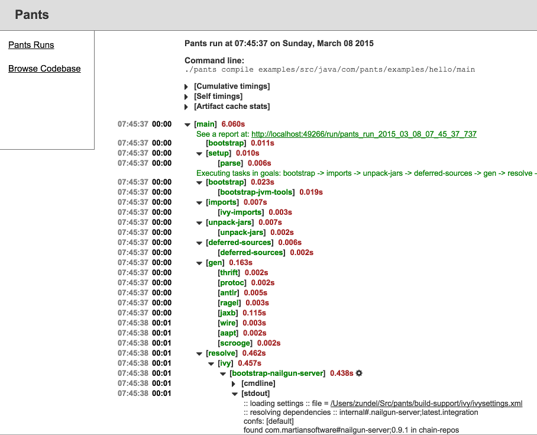

Pants: A fast, scalable build system
====================================
 

 
Pants is a build system designed for codebases that:

+ Are large and/or growing rapidly.
+ Consist of many subprojects that share a significant amount of code.
+ Have complex dependencies on third-party libraries.
+ Use a variety of languages, code generators and frameworks.

 

Pants supports Java, Scala, Python, C/C++, Go, Javascript/Node, Thrift, Protobuf and Android code.
Adding support for other languages, frameworks and code generators is straightforward.

Pants is a collaborative open-source project, built and used by Twitter, Foursquare, Square,
Medium and [[other companies|pants('src/docs:powered_by')]].

Getting Started
---------------

+ [[Installing Pants|pants('src/docs:install')]]
+ [[Setting Up Pants|pants('src/docs:setup_repo')]]
+ [[Tutorial|pants('src/docs:first_tutorial')]]

Cookbook
--------

The [[Common Tasks|pants('src/docs/common_tasks')]] documentation is a
practical, solutions-oriented guide to some of the Pants tasks that you're most
likely to carry out on a daily basis.

Pants Reference Documentation
-----------------------------

+ <a href="build_dictionary.html">BUILD Dictionary</a>
+ <a href="options_reference.html">Options Reference</a>

Powered by Pants
----------------

+ Find out [[who is using Pants|pants('src/docs:powered_by')]]

Contributing to Pants
---------------------

+ [[Pants Developer Center|pants('src/docs:dev')]]
+ [Code of Conduct](https://github.com/pantsbuild/pants/blob/master/CODE_OF_CONDUCT.md)
