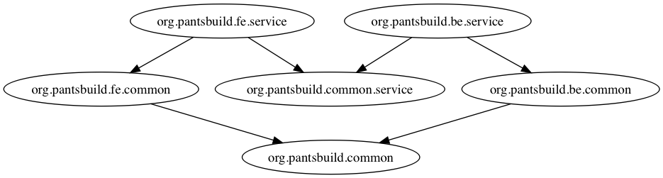
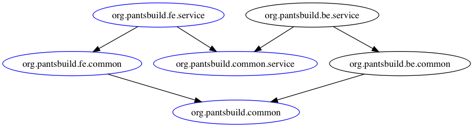
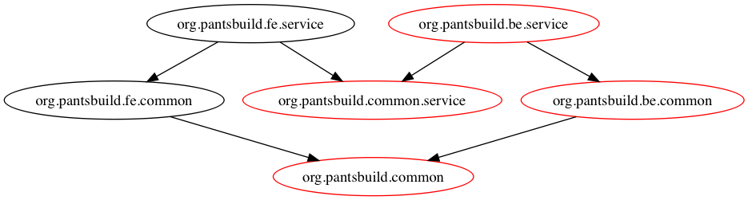

# Pants for Organizations

Pants works well for organizations with a large number of developers working in a multi-tenant repo.
Typically, repos become slower over time as more source and test files are added because most
build systems build and test everything every time. Pants enables the benefits of a single repo
with the speed of per-project repos by only operating on repo "slices".

## Frontend & Backend Example

Imagine a simple repo that contains both a frontend and backend service, as illustrated by the
following dependency graph.



Consider a frontend developer that only works on the frontend service. With most build systems, the
developer would need to compile everything every time, slowing them down over time as more and more
code is added to the repo. With Pants, the frontend developer only needs to compile the code directly
used by their service. For example, consider building `org.pantsbuild.fe.service`. Regardless of
how complex the backend code grows over time, the frontend build will not slow down.



Now consider a backend developer who only works on the backend service. When building the backend
service, only the code required by the backend service is built, regardless of what other code
is in the repo. The ability to build "slices" of the repo is fundamental to enabling multiple users
and teams to work together in a single repo. Note how only the backend code would be built when
building `org.pantsbuild.be.service`:



## Continuous Integration

Most organizations require test pass before merging a change to master. Pants enables fast CI by
only running tests _affected_ by a change. That is, only targets that transitively depend on a
changed target have their tests run. In practice, a change to `README.md` might not trigger *any*
tests, a change to a top-level node such as `org.pantsbuild.fe.service` in the dependency graph
would only trigger it's direct tests, and a change to a low-level node
(e.g.: protobuf/thrift IDL file) might trigger most tests.

For most users, the following script would work well for a pull-request builder type CI job:

<!-- TODO(#7346): Update this script to use --query! -->
```bash
#!/bin/bash

set -x
set -o
set -e

# Disable Zinc incremental compilation to ensure no historical cruft pollutes the build used for CI testing.
export PANTS_COMPILE_ZINC_INCREMENTAL=False

changed=("$(./pants --changed-parent=origin/master list)")
dependees=("$(./pants dependees --dependees-transitive --dependees-closed ${changed[@]})")
minimized=("$(./pants minimize ${dependees[@]})")
./pants filter --filter-type=-jvm_binary ${minimized[@]} | sort > minimized.txt

# In other contexts we can use --spec-file to read the list of targets to operate on all at
# once, but that would merge all the classpaths of all the test targets together, which may cause
# errors. See https://www.pantsbuild.org/3rdparty_jvm.html#managing-transitive-dependencies.
# TODO(#7480): Background cache activity when running in a loop can sometimes lead to race conditions which
# cause pants to error. This can probably be worked around with --no-cache-compile-rsc-write. See
# https://github.com/pantsbuild/pants/issues/7480.
for target in $(cat minimized.txt); do
  ./pants test $target
done
```
