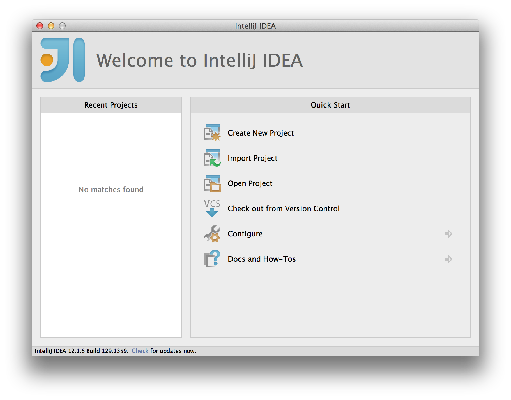
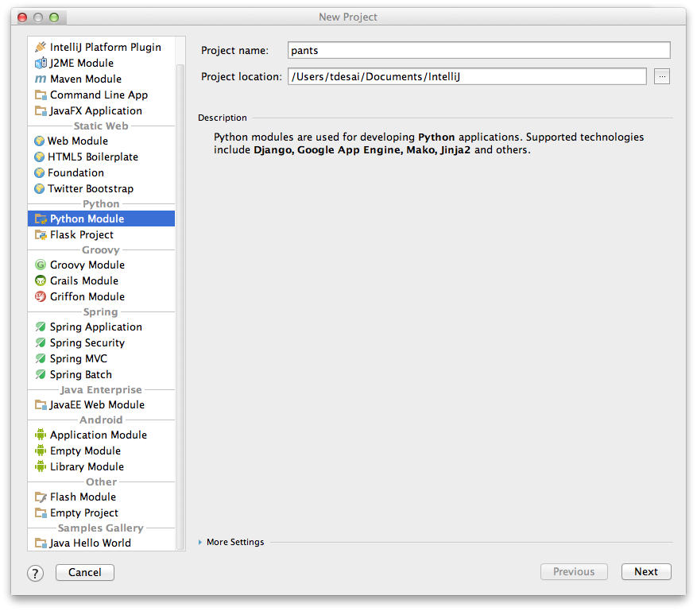
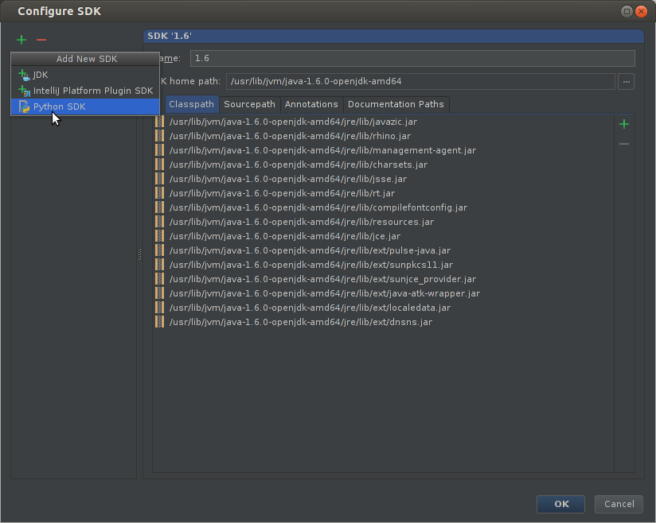
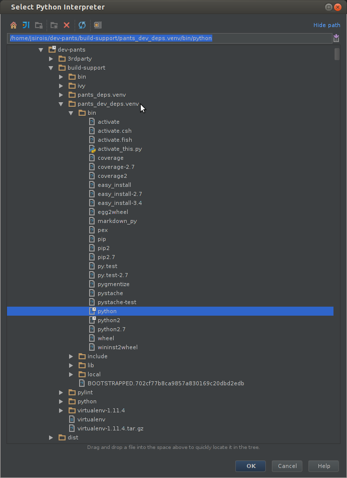
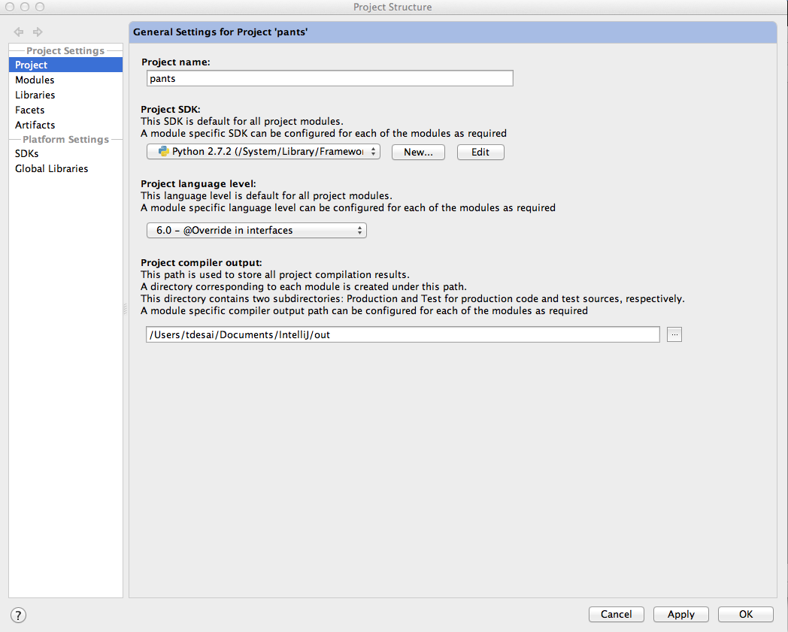
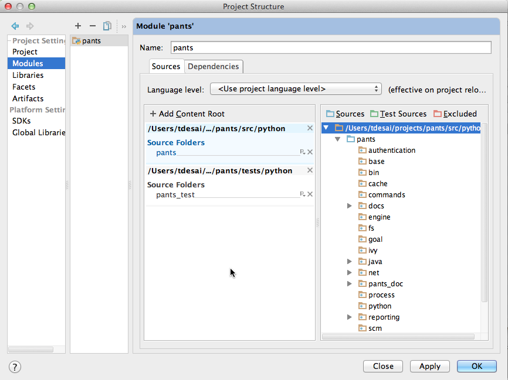
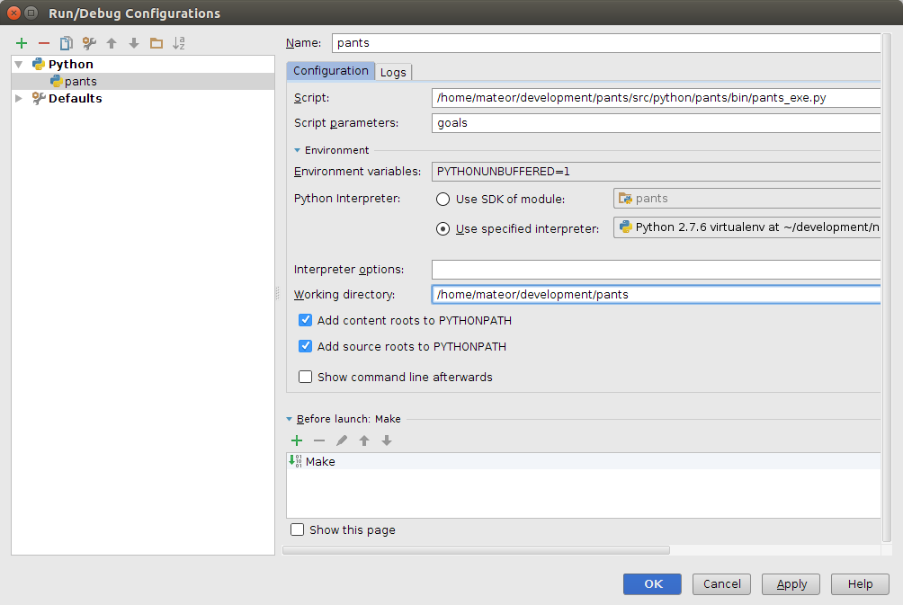
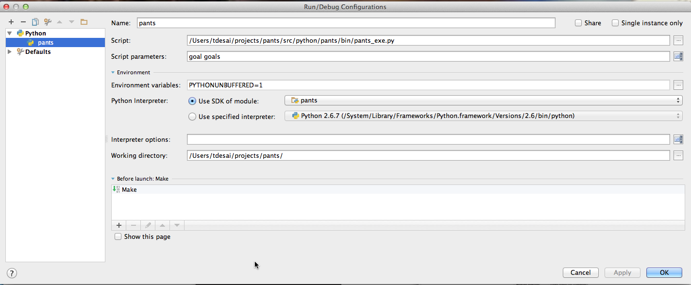

Pants Development with IntelliJ IDEA
====================================

This page documents how to develop pants with [IntelliJ
IDEA](http://www.jetbrains.com/idea/). (To use IntelliJ with Pants, not
necessarily to develop Pants itself, see
[[IDE Support|pants('src/docs:ide_support')]].

IntelliJ Setup
--------------

Set up IntelliJ for Python (if you haven't already):

- Download "IntelliJ IDEA Community Edition" from <http://www.jetbrains.com/>.
- Within IntelliJ, install the *Python Community Edition* plugin.

Project Setup
-------------

While Pants can generate IntelliJ IDEA projects for Java/Scala targets,
it cannot yet generate projects for Python targets. For this reason you
must manually create the project. This section walks you through that
process using IntelliJ IDEA 13.1.2.

First you need to bootstrap pants in developer mode. This is generally
the way you want to run pants when iterating and it also prepares a
virtual environment suitable for IDEs:

    :::bash
    $ ./pants

Next open IntelliJ and select "Create New Project".

In the "New Project" window, select "Python".

Then skip past the project templates screen and land at the Python
interpreter configuration screen. Click "Configure..." and add a "Python
SDK".

This will be a "local" interpreter and you'll need to select the virtual
environment bootstrapped above; it's in `build-support/pants_dev_deps.venv`.

Next specify a "Project name" and "Project location".

Now open the "File -\> Project Structure" window. For the "Project SDK"
choice, specify the python interpreter you configured above.

In the "Modules" section, you need to mark "Sources" and "Tests". This
establishes the loose python source roots to add to the PYTHONPATH - the
parent directory of what you'll import. Click the "+ Add Content Root"
button on the right, and choose the directory where you cloned pants.
Next, mark the `src/python` directory as sources and `tests/python`
directory as `test_sources` in this new content root. IntelliJ may
auto-select some sources and tests in directories such
as `examples/src/java`--you may wish to unselect these, as these are
example files used for tests and/or documentation.

Finally in "File -\> Settings -\> Python Integrated Tools" (or "IntelliJ
Idea -\> Preferences -\> Python Integrated Tools" if you are on Mac OS
X) set the default test runner to `py.test`, which is what pants uses to
drive python tests.

Now your project setup is complete!

Running Pants within IntelliJ IDEA
----------------------------------

In addition to editing pants code in IntelliJ, pants itself can be
run/debugged from within the editor. This is particularly useful for
fast iteration on the pants code base -- both within the pants repo, and
running the development version of pants from sources against a
different repo.

Open the "Run -\> Edit Configurations..." dialog box.

-   Add a new Python configuration.
-   Set the "Script" to the location of your
    `src/python/pants/bin/pants_exe.py` file (example:
    `/home/jsirois/dev-pants/src/python/pants/bin/pants_exe.py`)
-   Set the "Script parameters" to your pants command-line args, such as
    goals.
-   Set the "Working directory" to where you want to run pants from.
    Note this could be an entirely different repo from where the pants
    source code lives. This is very useful for making a pants change and
    testing in the repo where you use pants.

After creating the run configuration, simply run or debug pants from
within the editor. This will allow you to use all the regular Python
IntelliJ features to speed your pants development.

