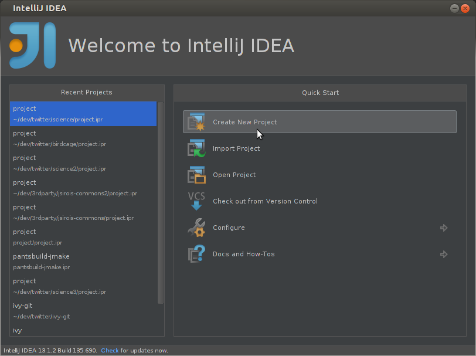
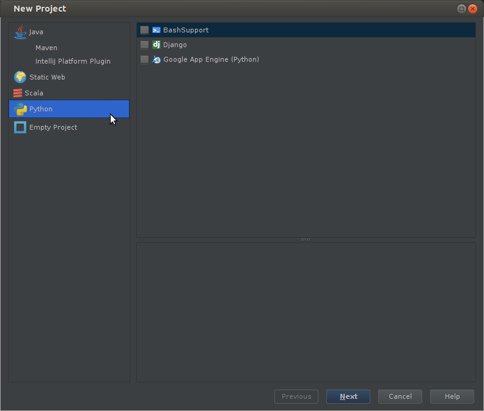
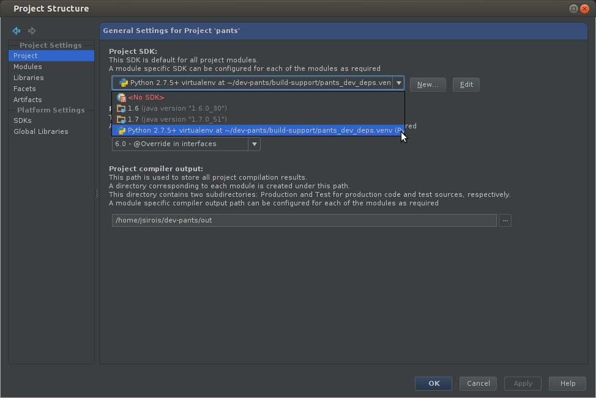
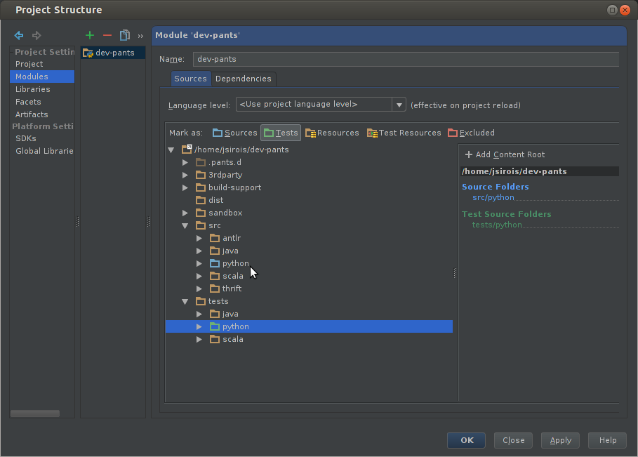
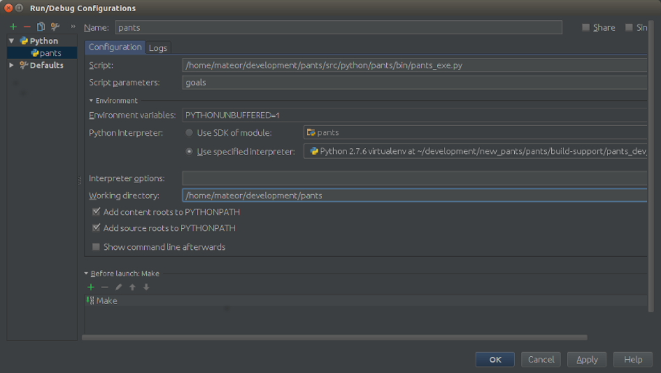

####################################
Pants Development with IntelliJ IDEA
####################################

This page documents how to develop pants with `IntelliJ IDEA <http://www.jetbrains.com/idea/>`_\.
(To use IntelliJ with Pants, not necessarily to develop Pants itself,
see :doc:`with_intellij`.)

**************
IntelliJ Setup
**************

As pants is a python application, the "Ultimate" (aka paid-for) edition of
IntelliJ is required, as is the Python plugin. You'll need to:

* Download "IntelliJ IDEA Ultimate Edition" from http://www.jetbrains.com/.
* Within IntelliJ, install the Python plugin.

*************
Project Setup
*************

While pants can generate IntelliJ IDEA projects for Java/Scala targets, it
cannot yet generate projects for Python targets. For this reason you must
manually create the project. This section walks you through that process.

Open IntelliJ and "Create New Project".

In the "New Project" window, select "Python Module" and specify the "Project
name" and "Project location." These should be outside the pants source repo so
they survive `clean-all` and `git clean` should those be necessary.

Open the "File -> Project Structure" window. In the "Project", specify your
python interpreter.

In the "Modules" section, make a new module and add two source roots, for the
sources and tests. Think of source roots as what your would put on the
PYTHONPATH - the parent directory of what you'll import. Mark the "twitter"
directory as sources or tests.

Lastly, we need to add egg dependencies. From the pants source repo, fetch the
eggs and move to a location outside the source repo so they survive
cleaning. ::

   $ ./build-support/python/clean.sh
   $ ./pants.bootstrap
   $ mv .pants.d/python/eggs ~/Documents/IntelliJ/pants-eggs

In the Project Structure -> Modules -> Dependencies dialog, add the eggs as
follows.

* Select the Dependencies tab.
* Click on "+" Button.
* Select "Jars or directories" and add the directory eggs were moved to above.
* Add as a "jar directory" (this is important).

.. image:: images/intellij-project-structure-modules-dependencies.png

Now your project set is complete!

**********************************
Running Pants within IntelliJ IDEA
**********************************

In addition to editing pants code in IntelliJ, pants itself can be run/debug
from within the editor. This is particularly useful for fast iteration both
within the pants repo, and running pants from sources against a different
repo.

Open the "Run -> Edit Configurations..." dialog box.

* Add a new Python configuration.
* Set the "Script" to
  `/Users/travis/src/commons/src/python/pants/bin/pants_exe.py`
* Set the "Script parameters" to your pants command-line args,
  such as `goal goals`.
* Set the "Working directory" to where you want to run pants from. Note this
  could be an entirely different repo from where the pants source code lives.
  This is very useful for making a pants change and testing in the repo where
  you use pants.

After creating the run configuration, simply run or debug pants from within
the editor using all the features that provides you.
