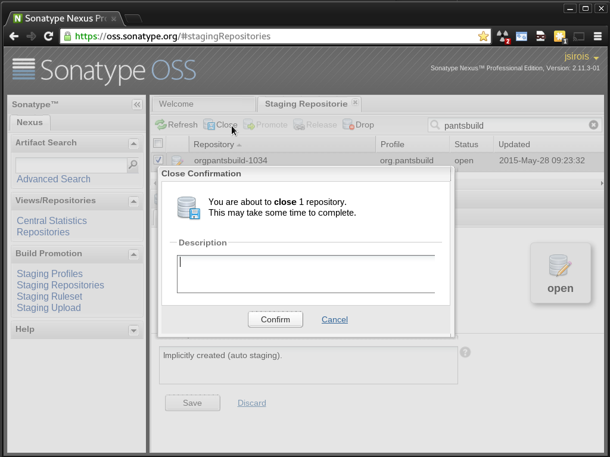
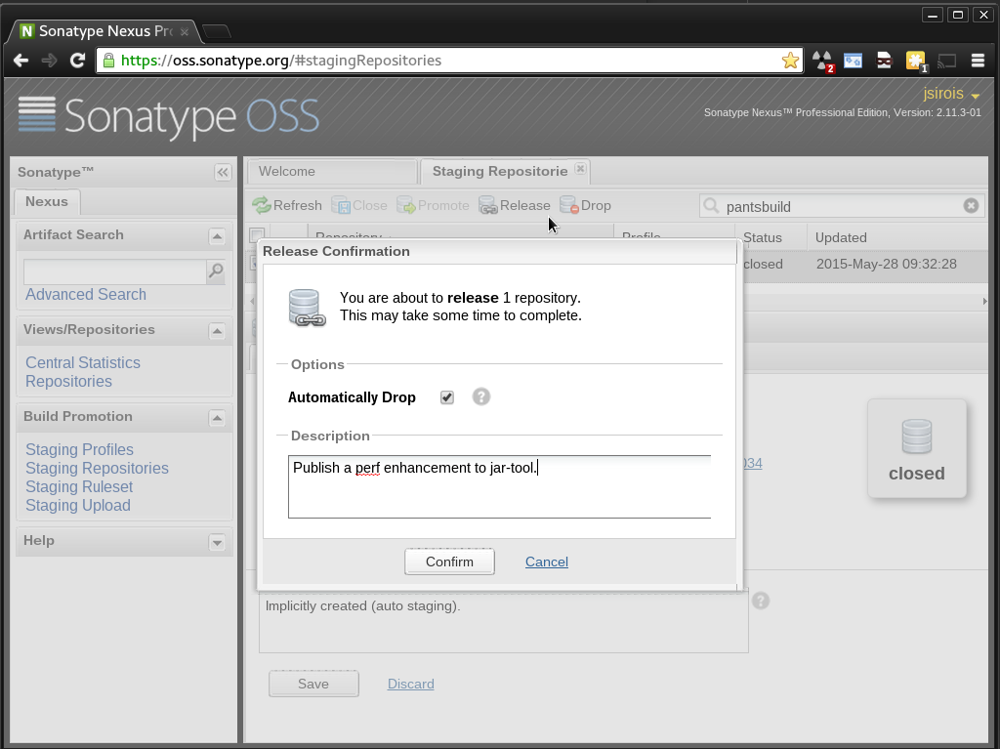

# JVM Artifact Release Process #

This page describes how to make a versioned release of the Pants jvm
tools to Maven Central.

Releasing jvm tools largely follows the
[[standard jar publishing process|pants('src/docs:publish')]], but has
some non-standard initial one-time setup.

At a high level, releasing pants jvm artifacts involves:

  - Deciding when to release.
    At present this is ad-hoc, typically when
    a change has been made to a tool and the author wants to use a
    version incorporating that change.
  - (optional) Perform a release [dry run](#dry-run).
  - [Staging](#staging-to-ossrh) the release to OSSRH.
  - [Promoting](#promoting-to-maven-central) the release to Maven Central.
  - [Dogfood](#dogfood) the release.

## Prerequisites ##

You must be at least a
[committer](https://github.com/orgs/pantsbuild/teams/committers) in
the pantsbuild GitHub organisation to publish pants artifacts.  If you
aren't yet, you need only ping the
[pants-devel](https://groups.google.com/forum/#!forum/pants-devel)
group to inquire about getting a release performed.

If you are a committer, there are four additional requirements to
satisfy in order to be able publish to Maven Central:

  - Create and publish a pgp key if you don't already have a published
    pgp key. There is nothing Maven Central specific about this, but
    Sonatype does provide
    [some instructions](http://central.sonatype.org/pages/working-with-pgp-signatures.html)
    you might follow.

  - [Create a sonatype.org JIRA account](https://issues.sonatype.org/secure/Signup!default.jspa)
    if you don't already have one.

  - Ask an existing Pants Maven Central [releaser](#releasers) to
    create a sonatype.org JIRA ticket to get you added to the
    org.pantsbuild maintainers.  You'll need to give them your
    sonatype.org JIRA account id. Here's an
    [example ticket](https://issues.sonatype.org/browse/OSSRH-12754)
    they can use as a template.  Once this is done and you've performed
    your 1st release, add yourself to the [Releasers](#releasers)
    section below.

  - Create a `~/.config/pants/release/jvm/pgp.properties` file to store the
    credentials Pants needs to sign artifacts uploaded to sonatype.org.
    This process is [described below](#pgp-credentials).

  - Create an entry in your `~/.netrc` file to enable authentication to Sonatype.

        machine oss.sonatype.org
          login jsirois
          password XYX

### PGP Credentials ###

Artifacts released to Maven Central must be pgp-signed.  In order to
sign artifacts, the pants jar publishing process currently needs access
to your pgp key passphrase via file (There is an issue
[here](https://github.com/pantsbuild/pants/issues/1407) tracking a better
solution).

First you'll need to create a secure
[java properties file](https://docs.oracle.com/javase/6/docs/api/java/util/Properties.html#load(java.io.Reader))
to hold your pgp credentials:

    :::bash
    $ mkdir -p ~/.config/pants/release/jvm && \
      touch ~/.config/pants/release/jvm/pgp.properties && \
      chmod 600 ~/.config/pants/release/jvm/pgp.properties

The properties file supports the following keys with noted defaults if omitted:

  - `pgp.secring`

    Assumes your pgp implementation is gpg and defaults to `~/.gnupg/secring.gpg`

  - `pgp.keyid`

    Defaults to `auto`.  If you're unsure which pgp key `auto` will
    select and you use gpg, you can determine the key id and verify the
    passphrase in one fell swoop with the following command:

        :::bash
        $ killall gpg-agent; echo | gpg --sign -vv >/dev/null
        gpg: using PGP trust model
        gpg: key 67B5C626: accepted as trusted key
        gpg: no running gpg-agent - starting '/usr/bin/gpg-agent'
        gpg: waiting for the agent to come up ... (5s)
        gpg: connection to agent established
        [pinentry prompts for passphrase]
        gpg: writing to stdout
        gpg: RSA/SHA256 signature from: "67B5C626 John Sirois <john.sirois@gmail.com>"

    In this case the default key id is `67B5C626`.  You can add an entry
    to the properties file instead of relying on the default `auto`
    setting if you prefer to be explicit like so:

        :::bash
        $ echo pgp.keyid=67B5C626 >> ~/.config/pants/release/jvm/pgp.properties

  - `pgp.password`

    **This key is required**, you must use the passphrase of the pgp
    key identified by `pgp.keyid` as the value.  If you did not specify
    a `pgp.keyid` then this should be the passphrase for your default
    pgp key.

## Dry Run ##

Releases should only be published from master, so get on master and
ensure the changes you want to publish are present. After confirming
this, you can test out the publish in 2 ways:

  1. A dry run to get a preview of what will be published and why:

        :::bash
        $ ./pants clean-all publish.jar src/{java,scala}::

  2. A local publish to get a preview of both what will be published
     and why as well as the changelogs:

        :::bash
        $ ./pants clean-all publish.jar --no-dryrun --local=/tmp/m2 src/{java,scala}::

     Note that this "dry-run" technique somewhat confusingly passes
     `--no-dryrun` but only because the publish is local and to a
     temporary dir (the argument to `--local`).  You can also poke
     around in the `/tmp/m2` local maven repo if you're curious or want
     to double-check fine details of exactly what will be pushed.

## Staging to OSSRH ##

When you're ready to publish to Maven Central, the 1st step is to
publish the jvm tool jars to Sonatype's OSSRH staging repository.  Note
that nothing will actually go live until the staging repository is
[released by you later](#promoting-to-maven-central), so this step has
no consequences of global importance.  Pants will create and push git
tags for the staging releases you do here, but in the worst case the
tags will point to releases never promoted to Maven Central, which is
fine.

To do the staging release, it's a normal pants publish and it's easiest
to use the following command, which will publish everything that's
changed and only those things that have changed since the last publish:

    :::bash
    $ ./pants publish.jar --no-dryrun src/{java,scala}::

## Promoting to Maven Central ##

With the jvm tools published to the Sonatype OSSRH staging repository,
you'll need to complete the release using Sonatype's OSSRH Nexus
repository manager web UI.  Sonatype describes the process
[here](http://central.sonatype.org/pages/releasing-the-deployment.html)
but the process is also described below:

  1. Log into Sonatype's OSSRH Nexus repository manager web UI.

     You do this [here](https://oss.sonatype.org/#stagingRepositories).
     You should use the the same user id and password you use to login
     to the Sonatype JIRA server.

  2. Find the staging repository auto-created when you
     [staged the release](#staging-to-ossrh) above.

     As shown below, in the 'Staging Repositories' tab enter
     `pantsbuild` in the search box in the upper-right corner to filter
     the display to your staging repository.

     

     There should be exactly one repository listed and you should
     select its checkbox.

  3. Close the selected staging repository.

     As shown below, with the staging repository selected, there will
     be a 'Close' button available.  Look for in in the menu bar across
     the top of the repository list.  Click it.

    

    This will trigger a validation process that checks the staged
    artifacts for signatures, a valid POM and more.  When validation is
    complete, you'll receive an email from nexus@oss.sonatype.org with
    the subject 'Nexus: Staging Completed'.  You may need to click the
    'Refresh' button in the UI to see the 'Close' button transition to
    a disabled state and the 'Release' button to its right transition
    to an enabled state.

  4. Release the selected staging repository.

    As shown below, with the staging repository selected and closed,
    there will be a 'Release' button available.  Click it.

    

    This will trigger another round of artifact validation and another
    email, this time with subject 'Nexus: Promotion Completed'.  At
    this point you're all done and just need to wait ~10 minutes for
    the artifacts to be available in Maven Central and ~2 hours to show
    up in the
    [search index](http://search.maven.org/#search%7Cga%7C1%7Corg.pantsbuild).

## Dogfood ##

Check Maven Central to ensure everything looks good. You can browse the
[org.pantsbuild subtree](https://repo1.maven.org/maven2/org/pantsbuild)
to find the artifact(s) you just released.  Once available you can send
out an RB bumping the versions of the released tools in `BUILD.tools`.

## Releasers ##

The following folks are set up to publish to Maven Central for
org.pantsbuild:

- David Turner <dturner@twopensource.com>
- Eric Ayers <ericzundel@gmail.com>
- John Sirois <john.sirois@gmail.com>
- Stu Hood <stuhood@gmail.com>
